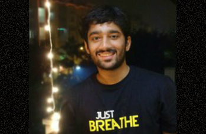
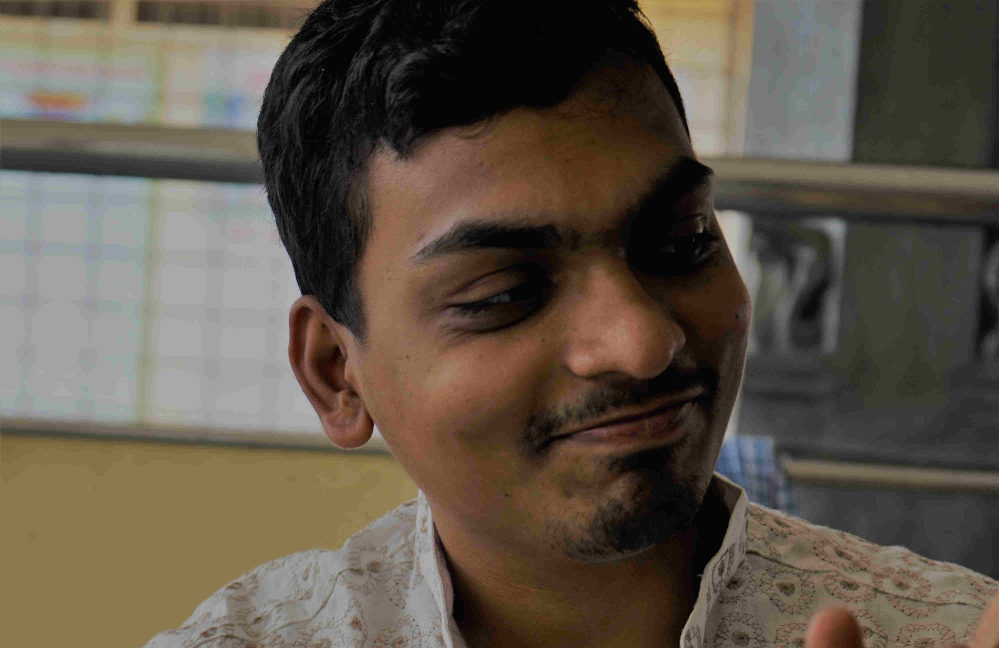

<section class="content-section section-team" id="team">
  

    

      <h3 class="text-secondary mb-0">The people who make it happen!</h3>
      <h2 class="mb-5">The Team</h2>
    

    

      <!-- Apoorv -->
      

        

          
          

            

              Apoorv Anand
            

            
Apoorv works at an intersection of Data science and engineering. He loves, develops and promotes open source software and research. He has been part of the data science teams at Ola and SocialCops and now works to strengthen the data-for-good ecosystem in the country

            

              
              
              
            

          

        

      

      <!-- Deepthi -->
      

        

          
          

            

              Deepthi Chand
            

            
Deepthi Chand aka DC is a data and tech evangelist. He has been instrumental as a chapter leader in defining the working operations of DataKind Bangalore. He has previously worked as a software consultant at Sahaj and Thoughtworks.   

            

              
              
              
            

          

        

      

      <!-- Gaurav -->
      

        

          
          

            

              Gaurav Godhwani
            

            
Gaurav works to strengthen data-for-good ecosystem in India, he has been instrumental in starting initiatives like DataKind Bangalore & Open Budgets India. He is passionate about Open Data, Open Source Tech, Education and Human Rights.   

            

              
              
              
            

          

        

      

    

    

      <!-- Shreya -->
      

        

          
          

            

              Shreya Agrawal
            

            
Shreya Agrawal is a data fanatic who loves to scrutanize data as well as answering unanswered questions using visualizations. She also enjoy developing softwares.
               
               
               
               
            

            

              
              
              
            

          

        

      

      <!-- Swati -->
      

        

          
          

            

              Swati Jaiswal
            

            
Swati is an Open Source enthusiast. She is passionate about the social impact of technology and works to add her contribution to the same. She has previously worked with Scrapinghub.
               
               
               
            

            

              
              
              
            

          

        

      

      <!-- Vivek -->
      

        

          
          

            

              Vivek Shrinivasan
            

            
Vivek works on designing and building web products. He previously worked at Gramener and Informatica where he designed and lead a team to build data products and dashboards for organisations like BMGF and Govt of India. He is passionate about design and its impact on people.

            

              
              
              
            

          

        

      

    

  

</section>